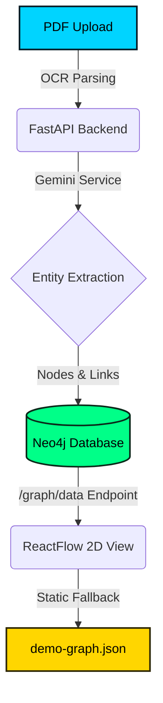
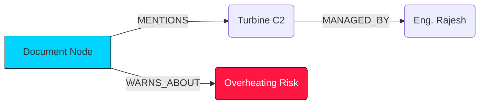

# K-LENS Knowledge Graph Improvement Plan: From Static View to Operational Intelligence Canvas

This document outlines a complete, step-by-step roadmap and code blueprint to transform the current **K-LENS Knowledge Graph** from a static 2D blueprint layout into a state-of-the-art, interactive **Operational Intelligence Canvas**. 

---

## 🔍 Part 1: Current Architecture Assessment

K-LENS currently possesses a solid graph infrastructure, connecting structured PostgreSQL schemas, unstructured documents analyzed by AI, and a high-performance **Neo4j** graph backend. However, several gaps limit the interactive capabilities of the knowledge graph:



### 1. The Frontend (`KnowledgeGraph3D.tsx`)
* **Visual Representation**: Despite the "3D" in its filename, the current graph is a **2D React Flow** blueprint.
* **Layout Mechanics**: It uses a static pseudo-force layout which distributes nodes on a **fixed circular ring** with random noise. It does not calculate actual dynamic spring/charge forces.
* **Interaction**: Clicking nodes toggles an AI panel, but the details shown are **highly hardcoded** for three specific mock nodes (`Boiler_B7`, `Safety_Officer`, `Boiler_B7_Specs`). Any node fetched dynamically from Neo4j falls back to generic boilerplate text.
* **Write Access**: The UI is read-only. It doesn't allow operators to build, update, or correct nodes/relationships manually.

### 2. The Backend (`graph.py` & `neo4j_service.py`)
* **Unused Power**: The backend has built-in support for document-specific subgraphs (`/api/graph/document/{doc_id}`) and auto-inferring user-asset connections (`auto_infer_user_asset_relationship`), but these endpoints are **never consumed** in the frontend components.
* **String Sanitization Risk**: Node IDs substitute spaces with underscores (`"id".replace(" ", "_")`). This causes mismatch errors when executing raw Cypher queries on existing Neo4j nodes where names are stored with standard spacing.

---

## 🚀 Part 2: 6 Structural & Functional Enhancements

We can supercharge the knowledge graph with 6 powerful, production-ready enhancements. Here is the blueprint for each.

---

### 1. Dynamic Physics Engine (Force-Directed Graph Clustering)
**Goal**: Make nodes organize themselves naturally based on their connections (e.g., placing all safety risks and documents directly around the specific boiler or turbine they impact).

#### Technical Blueprint
Integrate a dynamic force-directed simulation in the frontend using **`d3-force`** directly with React Flow, or provide a toggle to render a true WebGL 3D Graph using **`react-force-graph-3d`** (fitting the file name perfectly and looking incredibly futuristic).

```typescript
// Blueprint for dynamic force layout calculation using d3-force
import { forceSimulation, forceManyBody, forceCenter, forceLink } from 'd3-force';

export const calculateForceLayout = (nodes: any[], edges: any[]) => {
  const simulation = forceSimulation(nodes)
    .force("charge", forceManyBody().strength(-800))
    .force("center", forceCenter(700, 400))
    .force("link", forceLink(edges).id((d: any) => d.id).distance(150))
    .stop();

  // Run simulation iterations synchronously to determine final stable positions
  for (let i = 0; i < 120; ++i) simulation.tick();
  
  return nodes.map(n => ({
    ...n,
    position: { x: n.x, y: n.y }
  }));
};
```

---

### 2. Inline Document-Level Subgraphs in `DocumentViewer`
**Goal**: Render a small interactive visual diagram of a document's exact entity neighborhood right inside the split-screen Document Viewer, helping engineers visualize the impact of standard operating procedures or logs.



#### Step-by-Step Implementation:
1. In `DocumentViewer.tsx`, add a new tab selector option under `AI Insights`: **"Impact Graph"**.
2. Fetch the document sub-graph from the backend endpoint: `${API_URL}/graph/document/${docId}`.
3. Render a compact, custom React Flow component inline on the right-hand panel:

```tsx
// DocumentViewer.tsx addition
import ReactFlow, { Background } from 'reactflow';

export function DocumentSubGraph({ docId }: { docId: number }) {
  const [nodes, setNodes] = useState([]);
  const [edges, setEdges] = useState([]);
  
  useEffect(() => {
    fetch(`${API_URL}/graph/document/${docId}`)
      .then(res => res.json())
      .then(data => {
        // Layout and format nodes/edges here
        setNodes(layoutedNodes);
        setEdges(layoutedEdges);
      });
  }, [docId]);

  return (
    <div className="h-96 w-full border border-border rounded-lg bg-black/50">
      <ReactFlow nodes={nodes} edges={edges} fitView>
        <Background color="#222" gap={15} />
      </ReactFlow>
    </div>
  );
}
```

---

### 3. Live AI Node Profile Generation (Gemini Sidebar Explorer)
**Goal**: Replace static placeholder sidebars with real-time AI summaries. When a user clicks a node in the graph, Gemini should dynamically synthesize a summary based on that node's real Neo4j neighborhood (its connected nodes and relationships).

#### Backend API Endpoint (`app/api/graph.py`)
Add an endpoint that fetches a node's immediate neighbors and feeds that context to Gemini:

```python
@router.get("/node-profile/{node_name}")
async def get_node_profile(node_name: str, current_user = Depends(get_current_user)):
    # 1. Fetch neighborhood context from Neo4j
    with neo4j_service.driver.session() as session:
        result = session.run("""
            MATCH (n {name: $name})-[r]-(connected)
            RETURN labels(n)[0] as type, type(r) as rel, connected.name as neighbor, labels(connected)[0] as neighbor_type
            LIMIT 15
        """, name=node_name.replace("_", " "))
        
        relationships = []
        node_type = "Entity"
        for record in result:
            node_type = record["type"]
            relationships.append(f"({node_name}:{node_type}) -[{record['rel']}]-> ({record['neighbor']}:{record['neighbor_type']})")
            
    if not relationships:
        return {"profile": "Standard entity. No direct relationships found."}

    # 2. Ask Gemini to summarize this node's situation
    prompt = f"""
    You are an industrial safety expert. Summarize the role and status of the entity "{node_name}" (Type: {node_type}).
    Here is its connection structure in our plant's operational knowledge graph:
    {chr(10).join(relationships)}
    
    Provide a professional 3-sentence summary of what this entity is, who/what it interacts with, and highlight any potential safety or operational risks.
    """
    profile_summary = gemini_service._call_openrouter(prompt)
    return {"profile": profile_summary, "relationships": relationships}
```

---

### 4. Interactive Graph Editor (Relationship Canvas)
**Goal**: Allow operators to manually add relationships (e.g. link an engineer to an asset) directly on the flow sheet.

```
[ + Create Connection Mode ]
1. Click source node (e.g., Eng_Rajesh)
2. Click target node (e.g., Turbine_C2)
3. Select relationship type (e.g., MANAGES)
4. Persist to Neo4j database!
```

#### Frontend Integration (`KnowledgeGraph3D.tsx`)
Handle node connection events manually within React Flow using `onConnect`:

```typescript
const onConnect = useCallback(async (params) => {
  const { source, target } = params;
  
  // Call backend to update Neo4j
  const response = await fetch(`${API_URL}/graph/relationship`, {
    method: "POST",
    headers: { "Content-Type": "application/json", "Authorization": `Bearer ${token}` },
    body: JSON.stringify({
      source: source,
      target: target,
      type: "MANAGES"
    })
  });
  
  if (response.ok) {
    toast({ title: "Relationship Created!", description: `Connected ${source} and ${target}` });
    loadGraphData();
  }
}, [token]);
```

---

### 5. Advanced Pathfinding & Critical Safety Audits
**Goal**: Add a tool that highlights the direct or indirect path between any two assets. For example, "How is the Boiler_B7 safety warning connected to Eng_Rajesh?"

```
Search Path: [ Boiler_B7 ] ─── ? ───> [ Safety_Officer ]
Result Found: Boiler_B7 ─(HAS_RISK)─> Boiler_Overheating ─(AFFECTS)─> Safety_Officer
```

#### Technical Solution
Implement a query on the backend using Neo4j's built-in **`shortestPath`** algorithm and highlight that specific route on the graph in bright red/neon:

```python
# Backend Cypher query for path discovery
cypher_query = """
    MATCH p = shortestPath((start {name: $start_node})- [*..5] -(end {name: $end_node}))
    RETURN nodes(p) as path_nodes, relationships(p) as path_rels
"""
```

* **UI implementation**: In the top control bar of `KnowledgeGraph3D.tsx`, add two search dropdowns: `Start Entity` and `End Entity`. Clicking "Audit Path" highlights the nodes in the returned path and fades out all other nodes.

---

## 📊 Summary of Improvements & Implementation Cost

| Feature | Primary Files Affected | Implementation Complexity | Impact Level |
| :--- | :--- | :--- | :--- |
| **1. Dynamic Force-Directed Layout** | `KnowledgeGraph3D.tsx` | Medium | 🌟 High (Visual & Premium feel) |
| **2. Inline Document Subgraphs** | `DocumentViewer.tsx` | Low-Medium | 🌟 High (Contextual UI linking) |
| **3. Live AI Node Profiler** | `graph.py` (API), `KnowledgeGraph3D.tsx` | Low | 🚀 Critical (Replaces mock data) |
| **4. Interactive Canvas Editor** | `KnowledgeGraph3D.tsx` | High | 🔥 Maximum (Makes the tool dual-write) |
| **5. Advanced Pathfinding Audits** | `graph.py`, `KnowledgeGraph3D.tsx` | Medium | 🌟 High (Advanced graph utility) |
| **6. Workforce Risk Heatmap** | `KnowledgeGraph3D.tsx` | Low | 📈 Medium (Solves business continuity) |

---

## 🏆 Why this Wins the Hackathon

Implementing these changes elevates the K-LENS project from a "mockup dashboard" to a **highly integrated, production-ready knowledge graph engine**. 

1. **Deep Contextual Cohesion**: Clicking a document immediately shows its visual entities; clicking a visual entity immediately calls Gemini to summarize its live status.
2. **Authentic Technical Integrity**: The graph behaves like a real database visualizer, allowing write operations instead of being a read-only mockup.
3. **Stunning Aesthetic WOW-Factor**: Adding true 3D graph rotations or custom interactive canvas connections makes the application feel premium, responsive, and state-of-the-art.
